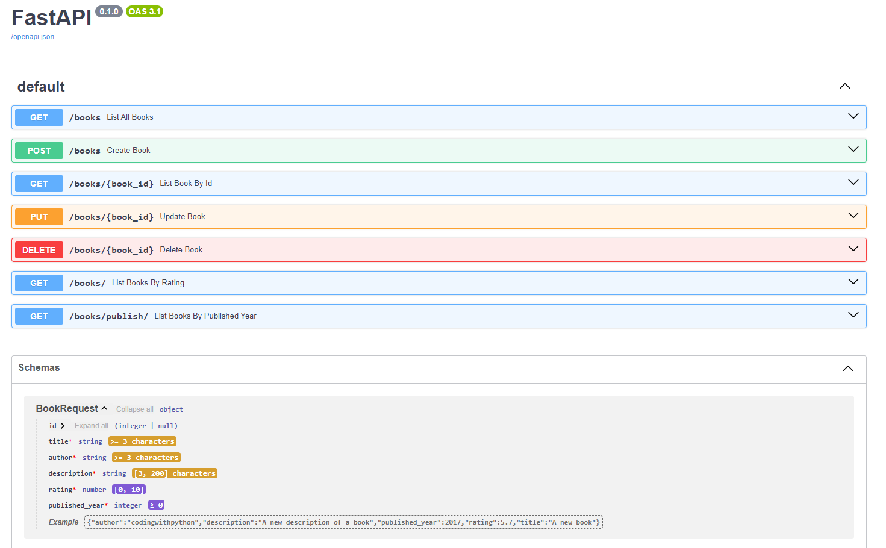

# API de Livros com FastAPI

Esta é uma API desenvolvida em Python utilizando o framework FastAPI, criada para aprofundar os estudos em Python e FastAPI.



## Funcionalidades

- Listar todos os livros
- Obter um livro por ID
- Filtrar livros por avaliação
- Filtrar livros por ano de publicação
- Criar um novo livro
- Atualizar um livro existente
- Excluir um livro existente

## Estrutura do Projeto

O projeto está estruturado da seguinte forma:

- **main.py**: Contém a configuração e definição das rotas da API.
- **Book.py**: Define a classe `Book` que representa a estrutura de dados de um livro.
- **README.md**: Este arquivo, contendo informações sobre o projeto.

## Instalação e Execução

Para executar o projeto localmente, siga os passos abaixo:

1. Clone o repositório:
```bash
git clone https://github.com/DavidWillian7/Books-API.git
cd Books-API
```
2. Crie um ambiente virtual (opcional, mas recomendado):
```bash
python -m venv venv
```
3. Ative o ambiente virtual (Windows):
```bash
venv\Scripts\activate
```
3. Ative o ambiente virtual (Linux/macOS):
```bash
source venv/bin/activate
```
4. Instale as dependências:
```bash
pip install -r requirements.txt
```
5. Execute o servidor:
```bash
uvicorn main:app --reload
```
Isso iniciará o servidor de desenvolvimento localmente. Você poderá acessar a documentação interativa da API em `http://localhost:8000/docs`.
